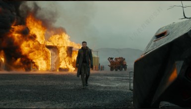
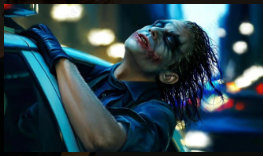
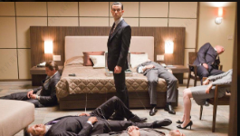
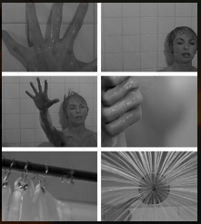
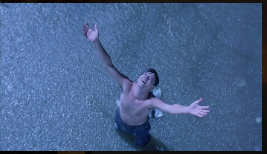

# 01：分镜基础：景别，角度，运镜

## 1-1，景别

景别-我们看什么?看的范围有多大?

景别决定了观众的注意力焦点，是叙事的基础。

- 大远景：展示巨大的空间和环境，人物往往很小，用于建立时代背景、地理环境，或表现人物的渺小、孤独。
- 远景：比大远景稍近，环境依然占主导，但能看清人物的整体动作和与环境的关系。
- 全景：展现人物的全身及其所在环境。常用于介绍人物出场或表现人物之间的空间关系。
- 中景：摄取人物膝盖以上部分。这是**最常用、最自然**的景别，既能看清表情，又能展示肢体动作，非常适合对话和互动，
- 近景：摄取人物胸部以上部分。引导观众关注人物的面部表情和细微情绪，是塑造人物、传递内心世界的关键。
- 特写：摄取人物的面部、眼睛，或一个关键的物体。具有极强的强调作用，能创造视觉冲击，揭示隐藏的细节或情感。
- 大特写：只摄取人物的某一局部，如眼睛、嘴唇，或物体的极小细节。极具风格化和象征意义，常用于营造紧张、神秘或强调某个至关重要的线索。

## 1-2，角度

角度-我们以什么视角看?

角度决定了画面的**权力关系**和**情感基调**。

- 平视角度：
  摄像机与人物眼睛持平。这是最客观、最平等的视角，常用于纪实风格或中性叙述。
- 俯拍角度：
  摄像机从高处向下拍摄。使被摄物体显得渺小、弱势、无助或被压迫。常用于表现角色的失败、困境或上帝视角的审视。
- 仰拍角度：
  摄像机从低处向上拍摄。使被摄物体显得高大、威严、有力量，甚至具有威胁性。常用于塑造英雄、伟人或反派。
- 倾斜角度
  又称“荷兰角”，画面是倾斜的。用于营造不安、混乱、迷失、癫狂的心理状态。常见于恐怖片、犯罪片或表现角色精神不稳定的时刻。

## 1-3，运镜

镜头运动-画面如何动起来?

镜头运动赋予了画面生命力和动态的节奏感。

**推 拉 摇 移 升 降 跟 追 甩**

1. 推镜头
   操作方式：摄像机沿光轴方向向前推进，或者通过变焦来实现类似效果。
2. 拉镜头
   操作方式：摄像机沿光轴方向向后拉远，或通过变焦实现。
3. 摇镜头
   操作方式：摄像机机位固定不动，机身进行水平或垂直的转动。
4. 移镜头
   操作方式：摄像机本身在空间中移动，可以横向、纵向、弧形或任意方向。
5. 升降镜头
   操作方式：摄像机在垂直方向上上升或下降，
6. 跟镜头
   操作方式：摄像机跟随运动的被摄主体一起移动。可以是从背后跟、侧面跟或前面跟.
7. 追镜头
   操作方式：与“跟镜头”非常相似，很多时候可以互换。但“追”更强调追逐的动态和目的性，常用于动作场面。
8. 甩镜头
   操作方式：一种极快的摇镜头。摄像机从一点急速地甩向另一点。

# 02：镜头语言基础：蒙太奇

**超越单个镜头**：镜头语言的组合与蒙太奇

单个镜头的设计是基础，但电影的魅力在于镜头的组合。这就是蒙太奇

1. 叙事蒙太奇：按照时间顺序连接镜头，流畅地讲述故事。
   
2. 平行蒙太奇：同时展现不同地点发生的相关事件，制造紧张感和对比(如“最后一分钟营救”)。《蝙蝠侠：黑暗骑士》
   
3. 交叉蒙太奇：是平行蒙太奇的强化版，两条或多条线索频繁交替，节奏更快。《盗梦空间》
   
4. 心理蒙太奇：通过镜头的组接来表现人物的内心世界，如回忆、梦境、幻觉、想象等。《惊魂记》
   
5. 隐喻蒙太奇：通过镜头的并列或交替，产生象征和隐喻意义。《肖申克的救赎》
   

# 课后作业
1. 分析一个你喜欢的电影，分析它的蒙太奇。
2. 分析一部电影中的景别，运镜调度的含义。
