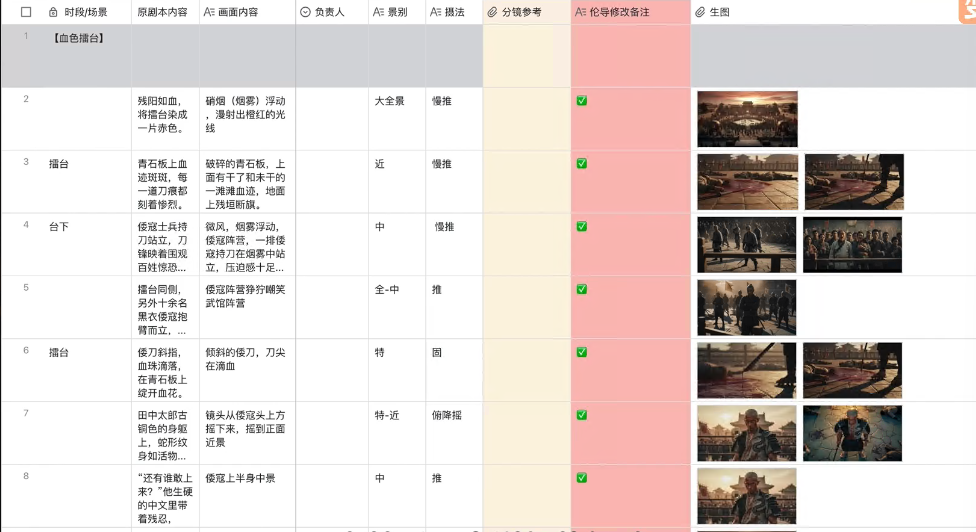
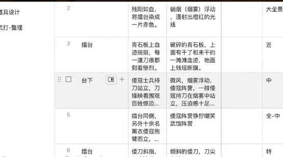
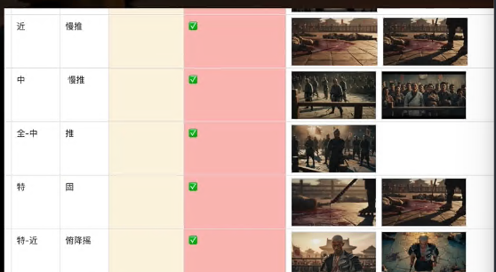
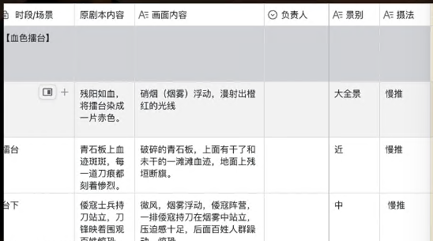
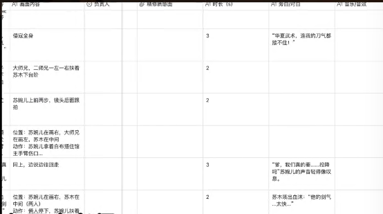
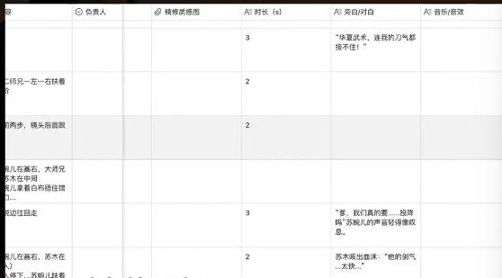
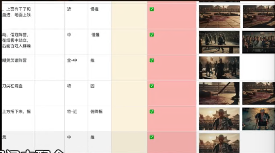
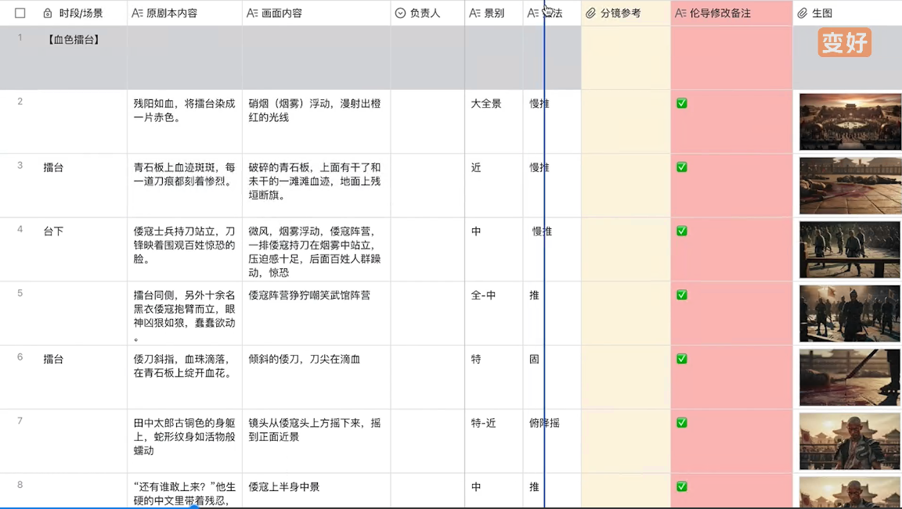
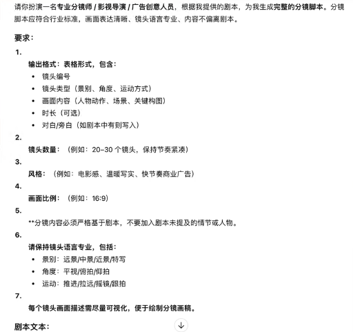

# 1. 分镜脚本的组成和格式

## 1.1 什么是分镜(为什么要学)

定义:分镜(Storyboard/Shotlist/分镜头脚本)把剧本的动作、节奏与镜头语言转换成逐镜头的视觉说明，包含画面构图、镜头运动、时长、对白与音效、转场等。

作用:视觉化故事，便于导演、摄影、美术、剪辑与制作协调。控制节奏与情感调度(每镜头时长直接影响节奏)。降低拍摄现场的沟通成本与时间成本。

## 1.2 分镜脚本核心组成

1. 镜号
   - 是什么:每个镜头的唯一编号，按顺序排列(如:SC1, SC2, 或1, 2, 3...)
   - 作用:方便在拍摄、剪辑和团队沟通时快速定位和引用特定镜头。有时会用到“镜号1A”来表示1号镜头的补充或备用角度。
     
2. 画面
   - 是什么:用草图、绘画或照片等形式描绘出镜头内的场景。
   - 作用:直观展示构图、角色位置、动作、表情、环境和景别。
     
3. 场景
   - 是什么:标明故事发生在哪个地点(如:办公室、城市街道、卧室)。
   - 作用:帮助团队成员快速了解故事发生的背景。
     
4. 内容/动作描述
   - 是什么:用文字补充说明画面中无法完全体现的细节。
   - 作用:描述角色的具体动作、表情变化、与环境的互动，以及重要的道具。
     
5. 对话/旁白
   - 是什么:角色在该镜头中说出的台词，或画外音的叙述。
   - 作用:推进剧情、塑造角色、传递信息。需要与角色的口型和表演精确匹配。
     
6. 音效/音乐
   - 是什么:该镜头中出现的声音元素。
     - 音效:环境音(如:车流声、鸟鸣)、动作音效(如:关门声、脚步声)、特殊音效等。
     - 音乐:标明背景音乐的起止、风格或情绪(如:紧张的音乐响起，舒缓的钢琴曲)。
   - 作用:营造氛围、增强真实感、引导观众情绪。
     
7. 时长
   - 是什么:预估该镜头的持续时间(如:2秒，5秒)。
   - 作用:帮助导演和剪辑师控制影片的节奏和总时长。
8. 镜头运动与特效
   - 是什么:描述摄影机的运动方式和后期特效。
   - 作用:标明需要后期添加的视觉效果，如CGI、绿幕抠像、色彩校正等。
     

---

# 2. AI应用结合:分镜生成

剧本一一AI提示词一一分镜脚本

1. 输出格式:表格形式
2. 镜头数量
3. 风格
4. 画面比例
5. 请保持镜头语言专业
6. 每个镜头画面描述需尽量可视化，便于绘制分镜画稿。
