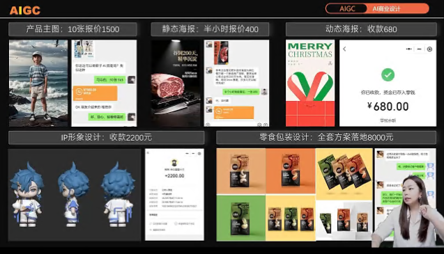
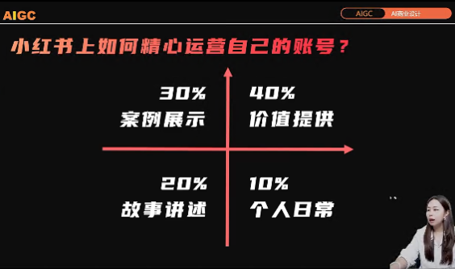

# 接单平台
## 简单平台
- 680
- 创客贴
- 搞定工坊
- https://make6000.com/job_center/
## 高阶平台
- 站酷
- 猪八戒
- 一品威客
### 跨过门槛：比稿获胜
- **优秀设计** 与 自己是否满意无关， 只需要 **客户喜欢**
- 搞定客户的不合理需求“五彩斑斓的黑”
1. 不要上来否定客户，要用专业说服客户：摆事实讲道理，摆出头部品牌的惯例（要暗示客户也会成为头部大牌）
2. 给出合理建议：要比客户更了解客户自己（拆解客户的条件/需求）
3. 给客户更多选择：2-3种有差异化的方案，让他没有拒绝的理由
  如 优雅/简约/复古

# 提高用户打款效率
- 超预期交付：把要设计的logo直接给用户放到其产品上/店面墙上/门店招牌上
- 提案心理学：不先给最满意方案
  - 保守型需求》主推型方案》创意型方案
  - 先安全保守满足基本需求，建立信任
  - 展示我的最佳方案，提高选中效率
  - 增加创意
- 反问式沟通引导，专业引导
  - 不要一个劲“好的”
  - 要“好，您要的是aaa，还是bbb，还是ccc“
- 用专业赢得客户认可

# 入驻前提
- 要有自己作品集
- 

# 平台保证能接单
- 接单一对一过稿指导
- 直接套用大量优秀样例参考（源文件+提示词）
- 专业模板+有效方法总结

# 展览会场全面设计
1. 主视图 背景板
1.1. 找参考图、别家样例
1.2. jimeng，设置尺寸，提示词
1.3. 超预期交付：背景板大图 图生图 做成立体展牌效果

# 如何给用户报价
- 不要第一个报价，而是先摸清客户心理价格范围
- 不要怕报高价

# 如何做小红书账户
